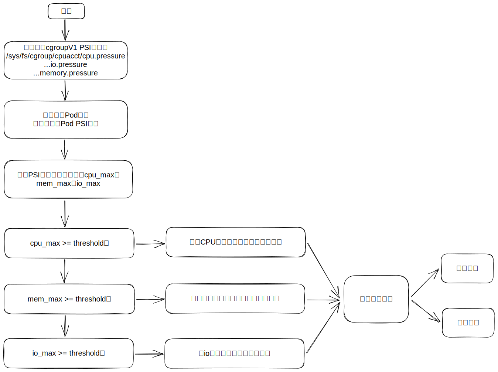

# 【需求设计】基于PSI指标的干扰检测

## 需求设计图



## 实现思路

### PSI简介

PSI是Pressure Stall Information的简称，用于评估当前系统三大基础硬件资源CPU、Memory、IO的压力。顾名思义，当进程无法获得运行所需的资源时将会产生停顿，PSI就是衡量进程停顿时间长度的度量标准。

### 使能cgroupv1 psi特性

首先，检查是否开启cgroup v1的PSI。两种方法，看看文件是否存在或者查看内核启动命令行是否包含psi相关选项。

```bash
cat /proc/cmdline | grep "psi=1 psi_v1=1"
```

若无，则新增内核启动命令行

```bash
# 查看内核版本号
uname -a
# Linux openEuler 5.10.0-136.12.0.86.oe2203sp1.x86_64 #1
# 找到内核的boot文件
ls /boot/vmlinuz-5.10.0-136.12.0.86.oe2203sp1.x86_64 
# 新增参数
grubby --update-kernel="/boot/vmlinuz-5.10.0-136.12.0.86.oe2203sp1.x86_64" --args="psi=1 psi_v1=1"
# 重启
reboot
```

随后便可以在cgroup v1中使用psi的三个文件观测数据。
例如，在`/sys/fs/cgroup/cpu,cpuacct/kubepods/burstable/<PodUID>/<container-longid>`目录下，涉及如下文件：

- cpu.pressure
- memory.pressure
- io.pressure

### 方案流程

针对PSI格式数据，使用`some avg10`作为观测指标。它表示任一任务在10s内的平均阻塞时间占比。

用户通过配置阈值保障在线Pod的资源可用以及高性能。具体来说，当阻塞占比超过某一阈值（默认为5%），则rubik按照一定策略驱逐离线Pod，释放相应资源。

在离线业务由注解`volcano.sh/preemptable="true"/"false"`标识。

```yaml
annotations:
    volcano.sh/preemptable: true
```

在线Pod的CPU和内存利用率偏高，rubik会驱逐当前占用CPU资源/内存资源最多的离线业务。若离线业务I/O高，则会选择驱逐CPU资源占用最多的离线业务。
> 注1：当前cgroup控制io带宽手段有效，难以精准判断驱逐哪个业务会降低io，因此暂时采用CPU利用率作为标准。
>
> 注2：通过cadvisor库实时获取离线业务的CPU利用率、内存占用量、IO带宽等信息，按指标从大到小排序。

需要处理可疑对象时则通过责任链设计模式传递事件处理请求，并执行相应操作。

## 实现设计


## 接口设计

```yaml
data:
  config.json: |
    {
      "agent": {
        "enabledFeatures": [
          "psi"
        ]
      },
      "psi": {
        "resource": [
          "cpu",
          "memory",
          "io",
        ],
        "interval": 10
      }
    }
```

`psi`字段用于标识基于psi指标的干扰检测特性配置。目前，psi特性支持监测CPU、内存和I/O资源，用户可以按需配置该字段，单独或组合监测资源的PSI取值。

| 配置键[=默认值] | 类型       | 描述                             | 可选值      |
| --------------- | ---------- | -------------------------------- | ----------- |
| interval=10 |int|psi指标监测间隔（单位：秒）| [10,30]|
| resource=[]     | string数组 | 资源类型，声明何种资源需要被访问 | cpu, memory, io |
| avg10Threshold=5.0     | float | psi some类型资源平均10s内的压制百分比阈值（单位：%），超过该阈值则驱逐离线业务 | [5.0,100]|
